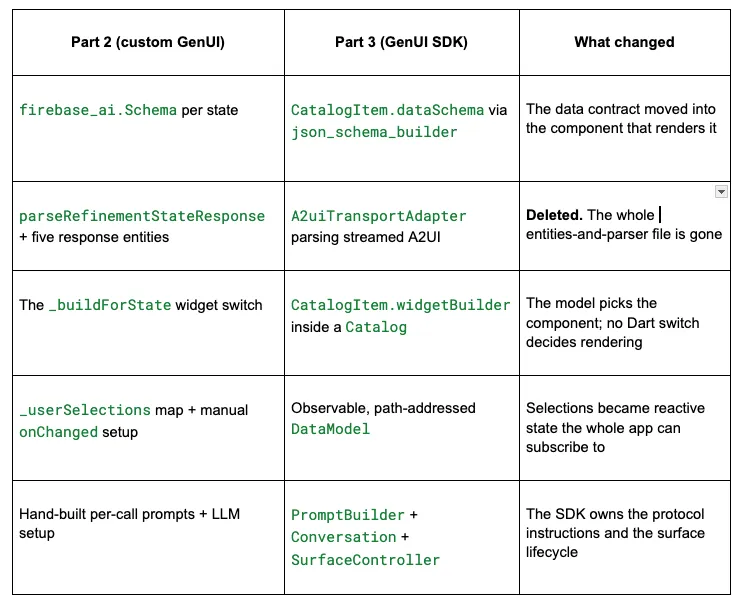
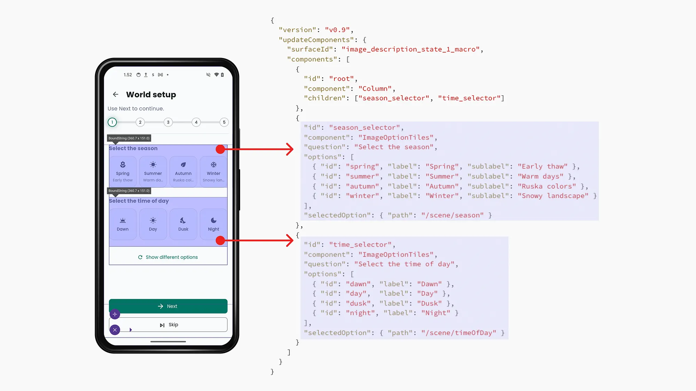
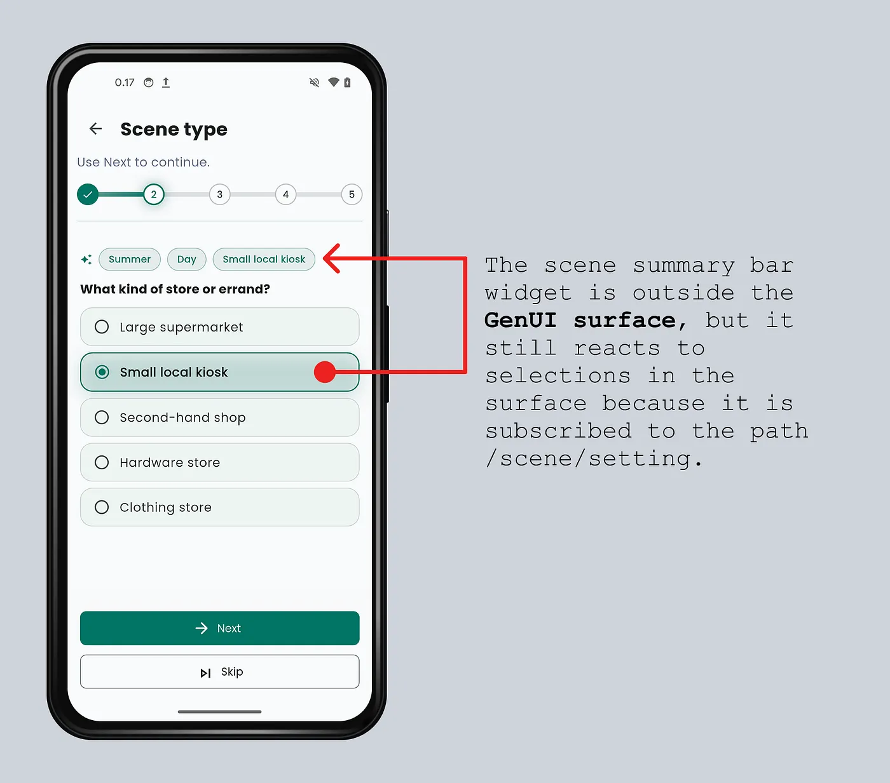
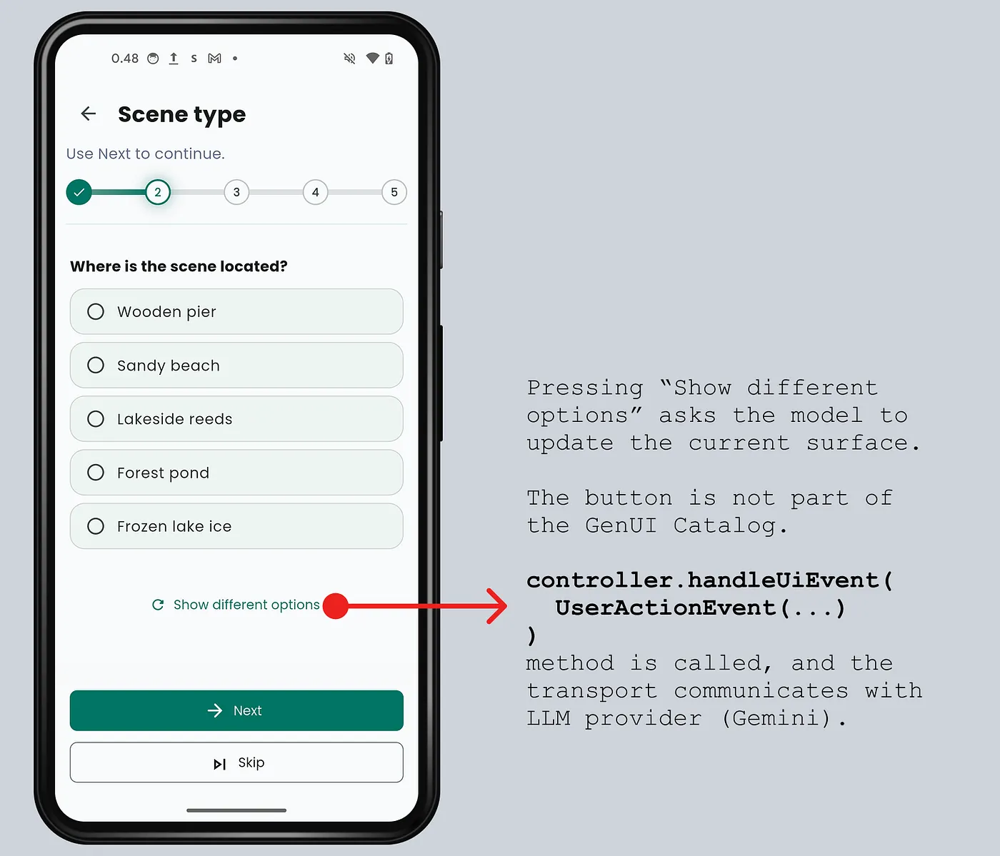

## not detail example of how the inspiration_design.md was implemented with the GenAI SDK

The migration map
The official Flutter GenUI SDK mapped almost one-to-one onto the custom solution from Part 2.



Migration summary from custom to official GenUI SDK
The Catalog replaced the widget switch
In Part 2, Dart code decided which widget rendered which response type, in a switch. In Part 3, Gemini chooses a component, but only from the catalog I registered.

A CatalogItem owns the schema and the builder. Here is ImageOptionTiles catalog item:

final _schema = S.object(
  description:
      'A compact tile selector for visual scene axes such as season, or the broad indoor/outdoor setting. '
      'Not for setting subtypes. Use concise localized labels.',
  properties: {
    'question': S.string(description: 'Question text shown above the tiles.'),
    'options': S.list(
      items: S.object(
        properties: {
          'id': S.string(
            description: 'Stable lowercase id used by the client for deterministic icon mapping.',
            enumValues: ['spring', 'summer', 'autumn', 'winter', 'indoor', 'outdoor'],
          ),
          'label': S.string(description: 'Short localized option label.'),
          'sublabel': S.string(description: 'Optional supporting label.'),
        },
        required: ['id', 'label'],
      ),
      minItems: 2,
      maxItems: 4,
    ),
    'selectedOption': A2uiSchemas.stringReference(
      description: 'Reference under /scene/* where the selection is stored.',
    ),
  },
  required: ['question', 'options', 'selectedOption'],
);

final imageOptionTiles = CatalogItem(
  name: 'ImageOptionTiles',
  dataSchema: _schema,
  widgetBuilder: (context) {
    final data = _ImageOptionTilesData.fromMap(
      context.data as Map<String, Object?>,
    );
    final value = data.selectedOption;
    final entries = data.options.map(_entryFromOption).toList();

    return BoundString(
      dataContext: context.dataContext,
      value: value,
      builder: (builderContext, selectedValue) {
        final selectedEntry = entries.cast<TileSelectorEntry?>().firstWhere(
          (entry) => entry?.id == selectedValue,
          orElse: () => null,
        );
        return TileSelectorWidget(
          question: data.question,
          entries: entries,
          selectedId: selectedEntry?.id,
          onSelected: (id) {
            final path = value?['path'] as String?;
            if (path == null) return;

            final selected = entries.firstWhere((entry) => entry.id == id);
            context.dataContext.update(DataPath(path), selected.label);
          },
        );
      },
    );
  },
);
Five things to notice.

First, the schema from Part 2 transferred almost directly. The model still gets a contract. If you did the structured-output pattern once, you already know how to write catalog schemas.

Second, context.data is the actual component payload Gemini generated for this catalog item. For a season selector of the “gardening” topic, it is roughly this:

{
 "question": "Select the season",
 "options": [
    { "id": "spring", "label": "Spring", "sublabel": "Seedlings" },
    { "id": "summer", "label": "Summer", "sublabel": "Growth" },
    { "id": "autumn", "label": "Autumn", "sublabel": "Harvest" },
    { "id": "winter", "label": "Winter", "sublabel": "Dormancy" }
 ],
 "selectedOption": { "path": "/scene/season" }
}
I don’t pass the payload map around raw. _ImageOptionTilesData.fromMap is a tiny extension type over the generated payload. This is just the adapter that makes the generated map easy to read inside the widget builder:

extension type _ImageOptionTilesData.fromMap(Map<String, Object?> _json) {
  String get question => _json['question'] as String;

  List<Map<String, Object?>> get options =>
      (_json['options'] as List<Object?>)
          .whereType<Map>()
          .map((e) => e.cast<String, Object?>())
          .toList();

  JsonMap? get selectedOption => _json['selectedOption'] as JsonMap?;
}
The id field is not shown to the user. It is a stable client-side key. The label is localized text; the id is what my app uses for deterministic UI behavior. This is exactly where an enum is the right tool: ImageOptionTiles only represents closed axes, so the model should choose icons from the client-known ids instead of inventing new ones.

TileSelectorEntry _entryFromOption(Map<String, Object?> option) {
  final id = (option['id'] as String?) ?? '';
  return TileSelectorEntry(
    id: id,
    label: (option['label'] as String?) ?? id,
    sublabel: option['sublabel'] as String?,
    icon: _iconForOption(id),
  );
}

IconData _iconForOption(String id) {
  return switch (id.trim().toLowerCase()) {
    'spring' => Icons.local_florist_rounded,
    'summer' => Icons.wb_sunny_rounded,
    'autumn' => Icons.eco_rounded,
    ...
    _ => Icons.auto_awesome_rounded,
  };
Third, selectedOption is a binding. The model says, "store this answer at /scene/season", and the widget writes there with dataContext.update.

onSelected: (id) {
  final selected = entries.firstWhere((entry) => entry.id == id);
  context.dataContext.update(DataPath(path), selected.label);
}
Fourth, BoundString is a new concept. In Part 2, the screen owned the selected value and passed it through callbacks. In GenUI, the selected value can live behind an A2UI reference such as {"path": "/scene/season"}. BoundString follows that reference, subscribes to the matching DataModel path, and rebuilds the widget when the value changes.

So trace what happens on a tap :

onSelected(id) fires and calls dataContext.update(DataPath('/scene/season'), 'winter'). This only writes to the DataModel. At this point nothing on screen has changed, and the app does not communicate with the Gemini model.
The DataModel notifies subscribers of /scene/season.
BoundString is that subscriber. It rebuilds its builder with the new selectedValue.
The builder derives selectedEntry from the value and passes selectedId into the stateless TileSelectorWidget, which now renders the highlight.
update() is the write; BoundString is the read. If you delete BoundString , the selected value will land in the DataModel but nothing ever rebuilds the widget to show it.

Fifth, the UI widget did not need to be rewritten. TileSelectorWidget is the same design-system widget from Part 2. The catalog item is just an adapter for GenUI. In fact, this is the catalog idea in one sentence:

Your catalog is your approved design system, handed to the model as its whole vocabulary.

The LLM does not pick colors, or invent layouts. It can only assemble the widgets you already built, styled, and tested.

GenUI does not replace your widget layer; it amplifies it. If your design-system widgets are small, reusable, theme-aware, and built for one clear purpose, you are already most of the way there. Catalog work becomes mostly schema, registration, and data binding.

The quality of the generated UI is capped by the quality of the components in the catalog.

FirebaseGenUiSession
A2UI does not care whether the model response comes from firebase_ai, a WebSocket, an A2A server, or Firebase Firestore document. It needs a transport that can do:

Receive a GenUI ChatMessage which is GenUI's request envelope.
Send it to the LLM (Gemini model in my case)
Feed the model’s streamed A2UI response back into GenUI
Flutter genui package is also agnostic to LLM providers. Hence, I need an adapter class that will be used across the app in different feature screens so that I do not copy the internals of A2UI, particularly how to convert GenUI messages into firebase_ai content in every feature implementation.

For Finnish It, I created an adapter called FirebaseGenUiSession. It is not provider-neutral. It is a Firebase-backed GenUI session wrapper for this app. I chose the simpler app-level boundary: all current GenUI flows use Firebase AI, so model creation, safety settings, token logging, and provider-side error reporting live in one shared place.

If you are building a reusable genui library or supporting several LLM providers, a more abstract design would move Firebase implementation outside of the adapter:

final session = GenUiSession(
  catalog: catalog,
  systemInstruction: prompt,
  onSend: sendToAnyModel,
);
A GenUI conversation is stateful. Its SurfaceController owns generated surfaces and DataModels. Its Conversation owns stream subscriptions. Its transport owns parser state. That state belongs to the current refinement flow, not to the whole feature.

This is why each Firebase-backed FirebaseGenUiSession is created for one refinement session and disposed when that session resets or ends. The lifecycle corresponds to the initializing and the disposing of the feature’s refinement screen ViewModel. The domain service class can live longer as the feature is singleton. It owns the product rules and starts new GenUI sessions as needed, but it does not keep one global GenUI conversation alive forever.


ImageDescriptionRefinementService a feature specific domain layer class that owns the business logic: wizard state, step prompts, allowed catalog, surface validation, retry/timeout, DataModel subscriptions, user selections.
FirebaseGenUiSession owns Firebase and GenUI connection to be consumed by all the app features:
PromptBuilder, firebase_ai model, A2UITransportAdapter,
Conversation, SurfaceController lifecycle. It hides the noisy A2UI and Firebase wiring so the each feature service can stay about the feature.
ImageDescriptionRefinementViewModel exposes listenables and delegates operations to the service, handles analytics.
ImageDescriptionRefinementScreen UI layer that renders the screen with the current GenUI Surface.
Here is the important shape of the class, as pseudocode:

class FirebaseGenUiSession {
  FirebaseGenUiSession({
    required Catalog catalog,
    required String systemInstruction,
    String? modelName,
  }) {
    // 1. GenUI runtime state. The controller stores multiple generated
    // surfaces and creates one DataModel per surface.
    controller = SurfaceController(catalogs: [catalog]);

    // 2. PromptBuilder adds the official A2UI instructions, the catalog
    // rules, allowed operations, and the feature's own system prompt.
    final systemPrompt = PromptBuilder.custom(
      catalog: catalog,
      allowedOperations: SurfaceOperations.createAndUpdate(dataModel: false),
      systemPromptFragments: [systemInstruction],
    ).systemPromptJoined();

    // 3. This implementation is Firebase-specific by choice.
    model = FirebaseAI.vertexAI(location: 'global').generativeModel(
      model: modelName ?? 'gemini-3.1-flash-lite',
      safetySettings: [SafetySetting(...), ...],
      systemInstruction: Content.system(systemPrompt),
    );

    // 4. The transport is the LLM provider boundary. Conversation calls
    // _sendToGemini; _sendToGemini streams model's A2UI response text 
    // back into transport.
    transport = A2uiTransportAdapter(onSend: _sendToGemini);

    // 5. Conversation connects the transport and the controller.
    // Parsed A2UI updates the surfaces. UI action events go back
    // through the same transport.
    conversation = Conversation(controller: controller,transport: transport);
  }

  // Public because the domain layer feature service class needs to read
  // DataModel values: session.controller.contextFor(surfaceId).dataModel.
  // The screen should usually receive host instead.
  late final SurfaceController controller;

  // Public for advanced flows. Most feature code should use events, sendText,
  // and sendMessage instead of touching Conversation.
  late final Conversation conversation;

  // Public for the ViewModel/UI. The Surface widget needs a SurfaceHost
  // and a surface id. It does not need Firebase, transport, or Conversation.
  SurfaceHost get host => controller;

  // Public for the domain layer feature service class. 
  // SurfaceAdded and ComponentsUpdated are where the service validates 
  // catalog id, surface id, root component, and allowed component types
  // before showing a step as ready.
  Stream<ConversationEvent> get events => conversation.events;

  // Public loading signal. The service/ViewModel map it to placeholders,
  // disabled buttons, and retry state.
  ValueListenable<bool> get isProcessing => processing;

  // Public provider-error stream. ConversationError covers GenUI failures;
  // this stream covers Firebase request failures and blocked responses.
  Stream<GenUiSessionError> get errors => providerErrors.stream;

  // Public command used by the service to ask for the current wizard step.
  Future<void> sendText(String prompt) {
    final message = ChatMessage.user(prompt);
    return conversation.sendRequest(message);
  }

  // Private Firebase bridge used by A2uiTransportAdapter.
  //
  // Feature code starts a turn with sendText. Conversation forwards
  // that ChatMessage to the transport, and the transport invokes this callback.
  // The callback is the only Firebase-specific hop: it sends the message to
  // Gemini, then feeds the streamed A2UI text back into the transport so
  // Conversation can update the SurfaceController.
  Future<void> _sendToGemini(ChatMessage message) async {
    processing.value = true;

    // Convert GenUI's message envelope to firebase_ai Content.
    final firebaseContent = convertToFirebaseContent(message);

    await for (final chunk in model.generateContentStream([firebaseContent])) {
      // Gemini streams plain text. In this prompt, that text is A2UI.
      // addChunk buffers partial text and emits parsed A2UI messages.
      if (chunk.text case final text?) {
        transport.addChunk(text);
      }
    }

    processing.value = false;
  }

  void dispose() {
    // Release the stateful GenUI resources owned by this flow.
    conversation.dispose();
    transport.dispose();
    controller.dispose();
  }
}
PromptBuilder
PromptBuilder is where the official GenUI instructions enter the model prompt. My feature system instructions does not have to manually explain the whole A2UI protocol. In addition to the feature specific system instructions, PromptBuilder also adds the catalog rules, component schemas, and allowed operations.

I use PromptBuilder.custom with SurfaceOperations.createAndUpdate(dataModel: false). The createAndUpdate part means the model may emit these A2UI operations: createSurface and updateComponents .

The dataModel: false part is just as important. It means PromptBuilder does not tell the LLM it can emit updateDataModel messages. Why not let the model update the DataModel too? Because in this flow, the LLM designs the question. The user answers it. When the learner taps “winter”, the catalog widget writes the value locally:

context.dataContext.update(DataPath('/scene/season'), selected.label);
That is deterministic Flutter code. It does not require another LLM turn, and it keeps the app in charge of the user’s selections. The model can bind a component to /scene/season, but it should not decide that /scene/season is already "winter" before the learner taps anything.

So the responsibility split is:

LLM: create/update the surface and declare bindings
Widget: write user selections into the DataModel
Domain layer: read the DataModel and build the image-generation refinement map.
If dataModel were true, the prompt would allow updateDataModel. That can be useful in flows where the agent is supposed to prefill values, apply a recommendation, or update state after a tool result.

SurfaceController
Your UI talks to the SurfaceController. It owns everything the model has generated: which surfaces exist, what components they hold, what every user selection currently is.

You construct a surface controller with your catalog. Then you use it in the Conversation, and in the Surface widget as a SurfaceHost.

You never push A2UI protocol messages into it yourself. Those arrive through the conversation.

It knows nothing about Gemini. You can feed it A2UI messages from a Firebase Firestore document and it would render them just as happily.

Catalog widgets write user answers into its DataModels, and the your code can read them back with the controller since it owns the DataModels:

final dataModel = genUiSession.controller.contextFor(surfaceId).dataModel;
A2UiTransportAdapter
Your LLM provider plugs into the A2uiTransportAdapter. This is the only place you write real integration code: You implement sendText, which delivers a ChatMessage to your LLM through the Conversation however you like, and you call addChunk(text) for each chunk the model streams back. Text out, text in. Buffering half-finished JSON, extracting complete messages, dropping malformed ones is the adapter's problem, not yours. _sendToGemini above is the entire Firebase-specific code in the session class.

Conversation
Conversation is the loop. It sends requests through the transport, forwards LLM’s parsed A2UI text messages into the controller, turns surface controller updates into ConversationEvents, and forwards explicit UI actions back to the model.

Model Stream Output in Chunks
This is what the model stream looked like for the first step after I stripped away the telemetry fields and kept only message.content[0].text:

chunk 1: ```json
chunk 2: \n{\n  \"version\": \"v0.9\",\n  \"createSurface
chunk 3: \": {\n    \"surfaceId\": \"image_description_state_1_macro\",\n    \"catalogId
chunk 4: \": \"com.finnishit.image_description.refinement\",\n    \"sendDataModel\": true
chunk 5: }\n}\n```\n```json\n{\n  \"version\": \"v0.9\",\n  \"
chunk 6: updateComponents\": {\n    \"surfaceId\": \"image_description_state_1_macro\",\n    \"
chunk 7: components\":
chunk 8:  [\n      {\n        \"id\": \"root\",\n        \"component\": \"Column\",\n        \"children\": [\n          \"season_selector\",\n          \"time_selector\"\n        ]\n      },\n      {\n
...
First, the stream is not valid JSON chunk by chunk. The catalog id is split across com and .finnishit.... The component id is split across season and _selector. So _sendToGemini should not parse anything. It should pass every text fragment to _transport.addChunk(text).

Second, the stream contains two A2UI messages, not one. The first creates the surface:

{
  "version": "v0.9",
  "createSurface": {
    "surfaceId": "image_description_state_1_macro",
    "catalogId": "com.finnishit.image_description.refinement",
    "sendDataModel": true
  }
}
The second fills it with components:



That is the useful mental model: the LLM streams text fragments; the transport reconstructs complete A2UI messages; the controller applies those messages to the surface.

The dispose order follows the same idea: stop the conversation first, stop the transport second, then let the controller release its surfaces and data models.

The Domain layer service class
The FirebaseGenUiSession is not the feature brain. ImageDescriptionGuidanceService is.

The service class creates one session for the current flow, subscribes to the session, and then owns every image-description decision around it:

which wizard step is active,
which prompt to send for that step,
whether the generated surface has a root component,
whether the generated components are allowed for the step,
when to retry or time out,
which /scene/* paths to observe,
how to turn the DataModel into the final refinement map for image generation.
The service class uses the FirebaseGenUiSession like this:

class ImageDescriptionRefinementService {

...

final genUiSession = FirebaseGenUiSession(
  catalog: ImageDescriptionRefinementCatalog.catalog,
  systemInstruction: _systemPrompt(
    languageName: language.name,
    languageCode: language.code,
  ),
  modelName: 'gemini-3.1-flash-lite',
);

_genUiSession = genUiSession;

_contentErrorSubscription = genUiSession.errors.listen(
  _onContentGeneratorError,
);

_conversationSubscription = genUiSession.events.listen(
  _onConversationEvent,
);

genUiSession.isProcessing.addListener(_onContentProcessingChanged);

await genUiSession.sendText(
  _buildGuidanceStateRequest(currentStep),
);

...

// Listens to the conversation instead of awaiting a JSON response:
void _onConversationEvent(ConversationEvent event) {
  switch (event) {
    case ConversationSurfaceAdded(:final surfaceId, :final definition):
      _onSurfaceDefinitionChanged(
        surfaceId: surfaceId,
        definition: definition,
        requireCompleteSurface: false,
      );
    case ConversationComponentsUpdated(:final surfaceId, :final definition):
      _onSurfaceDefinitionChanged(
        surfaceId: surfaceId,
        definition: definition,
        requireCompleteSurface: true,
      );
    case ConversationError(:final error, :final stackTrace):
      _failLoad(
        reason: 'Image description GenUI conversation error.',
        error: error,
        stackTrace: stackTrace,
      );
    // ...
  }
}

...
The same Finite State Machine (FSM) from Part 2
The migration keeps the same FSM but with rich enums. Each step now contains its own metadata instead of scattering it across switch statements.

enum _ImageDescriptionRefinementState {
  idle(step: 0, code: 'state_idle', title: 'Idle'),

  macroEnvironment(
    step: 1,
    code: 'state_1_macro',
    title: 'Macro Environment',
    answerComponentTypes: {'ImageOptionTiles', 'ImageSingleChoice'},
    bindings: [
      _SelectionBinding(
        path: '/scene/season',
        selectionKey: 'season',
        summaryAxis: 'season',
        isList: false,
      ),
      _SelectionBinding(
        path: '/scene/timeOfDay',
        selectionKey: 'time_of_day',
        summaryAxis: 'time',
        isList: false,
      ),
    ],
    rules: '''
- Axis: world-level physics only.
- Use ImageOptionTiles for season when seasonal variation helps the image; otherwise omit it.
- Use ImageOptionTiles for time of day when lighting variation helps the image; otherwise omit it.
- Season ids/order: spring, summer, autumn, winter.
- Time ids/order: dawn, day, dusk, night.
- Labels: 1 word. Sublabels: optional, 1-2 words. No full sentences.
''',
  ),

  // microSetting, narrativeContext, composition ...

  environmentElements(
    step: 5,
    code: 'state_5_elements',
    title: 'Environment Elements',
    answerComponentTypes: {'ImageTagCloud'},
    bindings: [
      _SelectionBinding(
        path: '/scene/elements',
        selectionKey: 'environment_elements',
        isList: true,
      ),
    ],
    rules: '''
- Axis: visible supporting details only.
- Use exactly one ImageTagCloud.
- Return 10-12 emoji-prefixed tags.
- Each tag after the emoji: 1-3 words, concrete and visually depictable.
- Mix: objects/entities, surface details, light/weather traces, simple motion cues.
- Align with selected setting/context, but do not restate season, time, setting, subject, framing, or mood.
- Avoid abstract, scientific, medical, poetic, or hard-to-see terms.
- Good tags: "🧊 Thin ice", "🌾 Snowy reeds", "💧 Water drops".
- Bad tags: "🌌 Deep indigo crepuscular shadows", "💧 Hypothermic water droplets".
''',
  ),

  completed(step: 0, code: 'state_completed', title: 'Completed');

  bool get isWizardStep => step > 0;

  String get surfaceId => 'image_description_$code';

  _ImageDescriptionRefinementState get nextStep => switch (this) {
    idle => macroEnvironment,
    macroEnvironment => microSetting,
    microSetting => narrativeContext,
    narrativeContext => composition,
    composition => environmentElements,
    environmentElements || completed => completed,
  };
}
Each state now asks Gemini for one A2UI output for the surface instead of one structured JSON response.

The DataModel is the new selections map
The data model of Part 2’s solution was the _userSelections map. The onChanged method fed it from every step widget.

In Part 3, the widgets write to the surface controller's DataModel, and the domain layer classes subscribes.

// ---------------------------------------------------------------------------
// SELECTION TRACKING
// ---------------------------------------------------------------------------
void _attachSelectionListeners({
  required _ImageDescriptionRefinementState state,
  required String surfaceId,
}) {
  // Each generated surface has its own DataModel. The SurfaceController owns
  // those models, so the domain layer service class asks it for the 
  // context of the current surface.
  final dataModel = genUiSession.controller.contextFor(surfaceId).dataModel;

  for (final binding in state.bindings) {
    // The DataModel caches one notifier per path. 
    // Subscribe with the same type argument the widget's Bound*
    // helper uses (BoundList: List<Object?>, BoundString: Object?).
    final ValueNotifier<Object?> notifier = binding.isList
        ? dataModel.subscribe<List<Object?>>(DataPath(binding.path))
        : dataModel.subscribe<Object?>(DataPath(binding.path));

    // Whenever the widget writes to the path, mirror the value into the app's
    // refinement map and, optionally, the "scene so far" summary.
    notifier.addListener(() {
      _updateSelection(binding, notifier.value);
    });
    // Also read the current value immediately. The user may have selected
    // something before this service listener was attached.
    _updateSelection(binding, notifier.value);
  }
}
The small object that makes this work is _SelectionBinding which is declared for each state (see the previous section):

/// Describes how one GenUI answer path maps back into app-owned state.
///
/// The LLM only declares bindings such as `/scene/season` in A2UI. The
/// catalog widget writes the user's tap into that `DataModel` path. The
/// domain layer class's subscribes to the path and mirrors the value into 
/// the plain refinement map used by the image-generation pipeline.
class _SelectionBinding {

  const _SelectionBinding({
    required this.path,
    required this.selectionKey,
    this.summaryAxis,
    this.isList = false,
  });

  /// A2UI `DataModel` path written by the generated catalog component.
  ///
  /// Example: `ImageOptionTiles.selectedOption` may point to `/scene/season`.
  /// When the learner taps a tile, the widget writes the selected label to this
  /// path with `dataContext.update(...)`.
  final String path;

  /// Key used in the app-owned refinement map.
  ///
  /// This is the stable name consumed outside GenUI, for example by
  /// `collectRefinementSelections()` before image generation. It intentionally
  /// does not have to match the A2UI path segment.
  final String selectionKey;

  /// Optional label for the "scene so far" summary shown outside GenUI.
  ///
  /// If this is null, the selection still goes into `_userSelections`, but it is
  /// not mirrored into the compact visual summary.
  final String? summaryAxis;

  /// Whether the path holds a list value (bound by BoundList in the widget).
  ///
  /// Determines the type argument used when subscribing to the DataModel.
  /// This must match the widget-side binding helper. Scalar components use
  /// `BoundString`/`Object?`; tag clouds use `BoundList`/`List<Object?>`.
  final bool isList;
}
In Part 2, each widget callback knew exactly which map key to write. In Part 3, the generated component only knows the A2UI path, such as /scene/season. _SelectionBinding tells the domain layer class how to translate that path into the rest of the app.

Each step declares its bindings once, on its enum value. You already saw macroEnvironment bind /scene/season and /scene/timeOfDay in the FSM section; when a surface arrives, the service just walks state.bindings.

Those subscriptions feed two app-owned consumers:

collectRefinementSelections(), which the Create button reads before handing the choices to the Part 1 image pipeline
the “scene so far” chip bar, which updates on every tap


Input Events Are for Intent
So far, every tap has done the same thing: write data. Tap “Winter,” /scene/season updates locally, and the model never hears about it.

The SDK supports a second kind of tap — one that carries intent instead of data. It says “do something,” not “store something.”

That second kind closed a real gap. Sometimes the five options Gemini generates just aren’t right, and none of the narrative choices match the scene the user pictured. Each step now has a small “Show different options” button. Tapping it stores nothing; it asks the model to compose the step again.

In the app, the intent event looks like this:


genUiSession.dispatchUiEvent(
  UserActionEvent(
    surfaceId: surfaceId,
    name: 'show_different_options',
    sourceComponentId: 'app_different_options_button',
    context: {
      'state': state.code,
      'topic': _activeTopicTitle,
      'brief': _activeTopicDescription,
      'selectedSoFar': Map<String, Object?>.from(_userSelections),
      'stepRules': state.rules,
    },
  ),
);


Four fields define that object, and only one of them is free-form:

surfaceId — which generated surface to revise. This is a first-class field on UserActionEvent, not a context value. Inside a catalog widget you never set it: the Surface injects it on the way out. This button lives in app-owned UI, outside any surface, so I set it myself.
name — what the user is asking for (show_different_options).
sourceComponentId — officially “the component that triggered the action.” A catalog widget would pass its own itemContext.id; an app-owned button has no surface component, so this is just an app-scoped label.
context — the state, topic, selected values, and step rules needed for one stateless call.
The event does not carry a long prompt. It does not repeat the catalog id. It does not repeat the response language. Those belong in the session’s system instruction not in every tap:

## Interaction Rules

- For action "show_different_options": respond with exactly one
  updateComponents message for the surfaceId in the action context.
  Keep the component types and DataModel binding paths from the context
  stepRules, but offer fresh, clearly different options. Send the
  complete component tree, not a partial update. Do not create a new
  surface.
From there, the SDK handles the rest:

handleUiEvent(...)
  -> SurfaceController.onSubmit
  -> Conversation
  -> A2uiTransportAdapter
  -> Gemini
  -> updateComponents
  -> SurfaceController
  -> Surface rebuilds
The nice part is that the response comes back through the same path as the initial surface. Same validator. Same ConversationComponentsUpdated event. Same rendering.

If the model returns a valid updateComponents message, the current step gets fresh options. If it replies with prose, uses the wrong component type, or times out, the old surface stays usable.

That is the final distinction:

”Winter” is data and stored in /scene/season locally
“Show different options” is intent and ask the model to update the current surface
Final words
Three posts in the series “Building Image Assisted Language Learning Practice with Flutter, Firebase and Gemini.”:

Part 1 explained the pipeline: Flutter + Firebase + Gemini turning a prompt into an annotated practice image.
Part 2 taught that the variety of images is a context problem, so we decomposed the scene into axes and hand-built wizard and accidentally a generative-UI solution to let the user pick a coordinate.
Part 3 swapped the custom GenUI engine for the official one: the model now composes each step from a catalog of our own widgets, speaking a protocol and the user can talk back through the same channel.
We didn’t make the Gemini model a Flutter developer. Instead we gave it a small vocabulary of our widgets and made it speak inside that boundary.

A custom GenUi implementation with system instructions from Part 2 can work. However, it quietly becomes a framework with an audience of one. Your schemas, your streaming parser, your event format, your repair loop, all yours to maintain and debug forever. A protocol changes this.

A2UI is a contract the LLM, the transport, and the UI all agree on, so the boring and bug-prone middle (partial-message buffering, surface lifecycle, two-way binding) is written once and battle tested by every app that adopts it, not reinvented in mine.